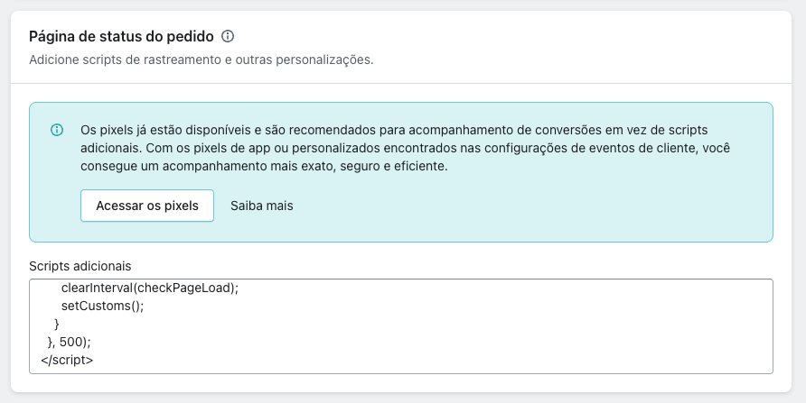

# Disco Script Hacks 👽

Desenvolvemos esses scripts para ajudar os usuários dos nossos clientes a terem uma melhor experiência de compra.

### Instalação

Para rodar os scripts, basta inserir o código no campo "Scripts adicionais" dentro de Configurações > Checkout > Página de status do pedido.

